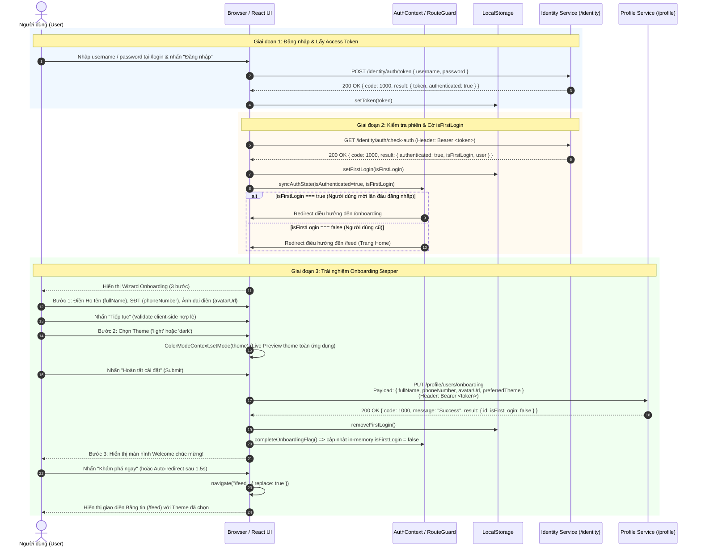

# Onboarding Flow, Dark/Light Mode & Backend API Contracts

> **Project**: Social App Frontend (`nginx-frontend`)  
> **Tech Stack**: React 18, React Router v6, Material-UI (MUI v5/v6), Axios, Context API  
> **Target Document**: `docs/ONBOARDING_FLOW.md`

---

## Mục lục (Table of Contents)

1. [Sơ đồ tuần tự (Mermaid Sequence Diagram)](#1-sơ-đồ-tuần-tự-mermaid-sequence-diagram)
2. [Chi tiết Backend Data Contracts](#2-chi-tiết-backend-data-contracts)
   - [2.1 POST `/identity/auth/token` (Login)](#21-post-identityauthtoken-login)
   - [2.2 GET `/identity/auth/check-auth` (Check-auth / Verify Session)](#22-get-identityauthcheck-auth-check-auth--verify-session)
   - [2.3 PUT `/profile/users/onboarding` (Complete Onboarding)](#23-put-profileusersonboarding-complete-onboarding)
   - [2.4 Bảng mã lỗi chuẩn (Standard Response & Error Codes)](#24-bảng-mã-lỗi-chuẩn-standard-response--error-codes)
3. [Frontend Architecture & State Flow](#3-frontend-architecture--state-flow)
   - [3.1 Quản lý Dark/Light Theme (`ColorModeContext`)](#31-quản-lý-darklight-theme-colormodecontext)
   - [3.2 Quản lý Authentication & Onboarding Flag (`AuthContext`)](#32-quản-lý-authentication--onboarding-flag-authcontext)
   - [3.3 Onboarding Stepper Wizard (`UserOnboarding.jsx`)](#33-onboarding-stepper-wizard-useronboardingjsx)
4. [Route Guard Decision Table (`ProtectedRoute.jsx`)](#4-route-guard-decision-table-protectedroutejsx)
5. [State Synchronization Reference](#5-state-synchronization-reference)
6. [Danh sách tệp tin liên quan (Files Reference)](#6-danh-sách-tệp-tin-liên-quan-files-reference)

---

## 1. Sơ đồ tuần tự (Mermaid Sequence Diagram)

Sơ đồ thể hiện toàn bộ luồng từ khi người dùng đăng nhập -> gọi API xác thực token `/check-auth` -> kiểm tra cờ `isFirstLogin` -> chuyển hướng vào `/onboarding` Stepper -> hoàn tất biểu mẫu hồ sơ & giao diện -> gọi `PUT /profile/users/onboarding` -> chuyển hướng về `/feed` (Trang chủ Home).



---

## 2. Chi tiết Backend Data Contracts

Hệ thống sử dụng cấu trúc phản hồi chuẩn RESTful JSON:
```json
{
  "code": 1000,
  "message": "Thông điệp kết quả",
  "result": { ... }
}
```

---

### 2.1 POST `/identity/auth/token` (Login)

Xác thực thông tin tài khoản người dùng và cấp JWT Access Token.

- **HTTP Method**: `POST`
- **Endpoint**: `/identity/auth/token` (qua API Gateway: `http://localhost:8888/api/v1/identity/auth/token`)
- **Yêu cầu bảo mật**: Public (Không cần Bearer token)
- **Content-Type**: `application/json`

#### Request Body
| Trường (Field) | Kiểu dữ liệu (Type) | Bắt buộc | Mô tả |
|---|---|:---:|---|
| `username` | `string` | **Có** | Tên đăng nhập của tài khoản |
| `password` | `string` | **Có** | Mật khẩu tài khoản |

**Ví dụ Request Body:**
```json
{
  "username": "hoangnam99",
  "password": "SecurePassword@123"
}
```

#### Response: `200 OK` (Thành công)
```json
{
  "code": 1000,
  "message": "Authentication successful",
  "result": {
    "token": "REDACTED_JWT..",
    "authenticated": true,
    "isFirstLogin": true
  }
}
```

#### Response: `401 Unauthorized` (Sai thông tin)
```json
{
  "code": 1006,
  "message": "Unauthenticated: Bad credentials or user not found",
  "result": null
}
```

---

### 2.2 GET `/identity/auth/check-auth` (Check-auth / Verify Session)

Kiểm tra tính hợp lệ của token hiện tại, lấy thông tin người dùng đang đăng nhập và kiểm tra cờ `isFirstLogin` để Frontend định tuyến chính xác.

- **HTTP Method**: `GET`
- **Endpoint**: `/identity/auth/check-auth` (qua API Gateway: `http://localhost:8888/api/v1/identity/auth/check-auth`)
- **Yêu cầu bảo mật**: Bearer Token (Yêu cầu Header `Authorization: Bearer <token>`)

#### Request Headers
| Header | Giá trị mẫu | Bắt buộc | Mô tả |
|---|---|:---:|---|
| `Authorization` | `Bearer  REDACTED_JWT| **Có** | Access Token được lưu tại LocalStorage |

#### Response: `200 OK` (Thành công - Người dùng lần đầu đăng nhập)
```json
{
  "code": 1000,
  "message": "Session is active and valid",
  "result": {
    "authenticated": true,
    "isFirstLogin": true,
    "user": {
      "id": "usr_9912",
      "username": "hoangnam99",
      "email": "hoangnam99@gmail.com",
      "fullName": null,
      "phoneNumber": null,
      "avatarUrl": null,
      "preferredTheme": "light",
      "roles": ["USER"]
    }
  }
}
```

#### Response: `200 OK` (Thành công - Người dùng cũ đã hoàn thành Onboarding)
```json
{
  "code": 1000,
  "message": "Session is active and valid",
  "result": {
    "authenticated": true,
    "isFirstLogin": false,
    "user": {
      "id": "usr_9912",
      "username": "hoangnam99",
      "email": "hoangnam99@gmail.com",
      "fullName": "Nguyễn Hoàng Nam",
      "phoneNumber": "0987654321",
      "avatarUrl": "https://res.cloudinary.com/socialapp/avatar_9912.png",
      "preferredTheme": "dark",
      "roles": ["USER"]
    }
  }
}
```

#### Response: `401 Unauthorized` (Token hết hạn hoặc không hợp lệ)
```json
{
  "code": 1006,
  "message": "Token has expired or is invalid",
  "result": {
    "authenticated": false,
    "isFirstLogin": false
  }
}
```

---

### 2.3 PUT `/profile/users/onboarding` (Complete Onboarding)

Gửi thông tin thiết lập ban đầu (Họ tên, Số điện thoại, Ảnh đại diện, Theme giao diện) lên Profile Service. Khi thành công, Backend sẽ cập nhật cơ sở dữ liệu và đánh dấu `isFirstLogin = false`.

- **HTTP Method**: `PUT`
- **Endpoint**: `/profile/users/onboarding` (qua API Gateway: `http://localhost:8888/api/v1/profile/users/onboarding`)
- **Yêu cầu bảo mật**: Bearer Token (Yêu cầu Header `Authorization: Bearer <token>`)
- **Content-Type**: `application/json`

#### Request Headers
| Header | Giá trị | Bắt buộc |
|---|---|:---:|
| `Authorization` | `Bearer <JWT_ACCESS_TOKEN>` | **Có** |
| `Content-Type` | `application/json` | **Có** |

#### Request Body (OnboardingRequest DTO)
| Trường (Field) | Kiểu (Type) | Bắt buộc | Ràng buộc / Validate | Mô tả |
|---|---|:---:|---|---|
| `fullName` | `string` | **Có** | Tối thiểu 2 ký tự, tối đa 100 ký tự | Họ và tên hiển thị của người dùng |
| `phoneNumber` | `string` | Không | Định dạng SĐT quốc tế hoặc nội địa (7-20 ký tự số) | Số điện thoại liên hệ |
| `avatarUrl` | `string` | Không | Định dạng URL hợp lệ (HTTP/HTTPS) | Đường dẫn ảnh đại diện |
| `preferredTheme` | `string` | **Có** | Chỉ nhận `"light"` hoặc `"dark"` | Chế độ sáng/tối người dùng ưu tiên |

**Ví dụ Request Body:**
```json
{
  "fullName": "Nguyễn Hoàng Nam",
  "phoneNumber": "0987654321",
  "avatarUrl": "https://images.unsplash.com/photo-1535713875002-d1d0cf377fde",
  "preferredTheme": "dark"
}
```

#### Response: `200 OK` (Thành công)
```json
{
  "code": 1000,
  "message": "User onboarding profile completed successfully",
  "result": {
    "id": "usr_9912",
    "username": "hoangnam99",
    "fullName": "Nguyễn Hoàng Nam",
    "phoneNumber": "0987654321",
    "avatarUrl": "https://images.unsplash.com/photo-1535713875002-d1d0cf377fde",
    "preferredTheme": "dark",
    "isFirstLogin": false,
    "updatedAt": "2026-09-22T04:15:00Z"
  }
}
```

#### Response: `400 Bad Request` (Dữ liệu không hợp lệ)
```json
{
  "code": 1003,
  "message": "Validation error: fullName must be at least 2 characters",
  "result": {
    "field": "fullName",
    "error": "size must be between 2 and 100"
  }
}
```

---

### 2.4 Bảng mã lỗi chuẩn (Standard Response & Error Codes)

| Mã Code | HTTP Status | Ý nghĩa | Hành vi xử lý tại Frontend |
|:---:|:---:|---|---|
| `1000` | `200 OK` | Thành công (Success) | Tiếp tục quy trình bình thường |
| `1003` | `400 Bad Request` | Dữ liệu đầu vào không hợp lệ | Hiển thị lỗi đỏ dưới ô nhập liệu tương ứng |
| `1006` | `401 Unauthorized` | Phiên đăng nhập hết hạn / Sai token | Xóa token, chuyển hướng về `/login` |
| `1007` | `403 Forbidden` | Không có quyền truy cập | Hiển thị thông báo từ chối truy cập |
| `9999` | `500 Server Error` | Lỗi máy chủ không mong muốn | Hiển thị toast thông báo lỗi hệ thống |

---

## 3. Frontend Architecture & State Flow

```
                  App.jsx
                     │
         ┌───────────┴───────────┐
         ▼                       ▼
ThemeProviderWrapper       AuthContext.Provider
  (MUI Theme, CSS)      (isFirstLogin, auth token)
         │                       │
         └───────────┬───────────┘
                     ▼
                 AppRoutes
                     │
           ┌─────────┴─────────┐
           ▼                   ▼
      /login, /register   ProtectedRoute (Route Guard)
                               │
                ┌──────────────┴──────────────┐
                ▼                             ▼
       isFirstLogin === true        isFirstLogin === false
                ▼                             ▼
      /onboarding (Stepper)           /feed, /profile, ...
```

### 3.1 Quản lý Dark/Light Theme (`ColorModeContext`)
- **Vị trí**: `src/context/ColorModeContext.jsx` & `src/providers/ThemeProviderWrapper.jsx`
- **Key lưu trữ**: `localStorage.getItem("social_app_theme_mode")` (`'light'` hoặc `'dark'`).
- **Khởi tạo mặc định**: Ưu tiên giá trị đã lưu trong `localStorage`; nếu chưa có sẽ fallback theo cấu hình hệ điều hành `window.matchMedia("(prefers-color-scheme: dark)")`.
- **Cung cấp**:
  - `mode`: Giá trị theme hiện tại (`'light'` | `'dark'`).
  - `toggleColorMode()`: Chuyển đổi nhanh qua lại giữa sáng và tối.
  - `setMode(newMode)`: Gán chế độ cụ thể (được sử dụng tại Bước 2 của Onboarding để xem trước - Live Preview).

### 3.2 Quản lý Authentication & Onboarding Flag (`AuthContext`)
- **Vị trí**: `src/context/AuthContext.jsx` & `src/hooks/useAuth.js`
- **Key lưu trữ**: `localStorage.getItem("social_app_first_login")` (`'true'` hoặc `'false'`).
- **Cung cấp**:
  - `isAuthenticated`: `boolean` xác nhận trạng thái đăng nhập.
  - `isFirstLogin`: `boolean` cờ đánh dấu cần vào luồng Onboarding.
  - `completeOnboardingFlag()`: Hàm dọn dẹp cờ trong `localStorage` và cập nhật state in-memory `isFirstLogin = false` ngay tức thì (giúp Router không bị loop redirect mà không cần F5 reload trang).

### 3.3 Onboarding Stepper Wizard (`UserOnboarding.jsx`)
Giao diện Wizard 3 bước sử dụng MUI Stepper với hiệu ứng chuyển động mượt mà:
1. **Bước 1 — Profile Setup**:
   - Nhập `fullName` (Validate bắt buộc, tối thiểu 2 ký tự).
   - Nhập `phoneNumber` (Validate regex số điện thoại).
   - Nhập `avatarUrl` (Xem trước avatar dạng hình tròn ngay khi nhập URL).
2. **Bước 2 — Theme Preference**:
   - Lựa chọn chế độ giao diện `Light Mode` hoặc `Dark Mode`.
   - Xem trước trực quan với Toggle Button có icon Mặt trời/Mặt trăng; ứng dụng đổi màu ngay khi người dùng bấm chọn.
   - Nút "Hoàn tất cài đặt": Gửi request `PUT /profile/users/onboarding`.
3. **Bước 3 — Welcome**:
   - Hiển thị animation chúc mừng thành công.
   - Nút "Khám phá ngay" điều hướng về `/feed` (`/`).

---

## 4. Route Guard Decision Table (`ProtectedRoute.jsx`)

Mọi route bảo mật đều được kiểm soát chặt chẽ thông qua bảng quyết định sau:

| `isAuthenticated` | `isFirstLogin` | URL hiện tại (`pathname`) | Hành động điều hướng | Ghi chú |
|:---:|:---:|:---:|---|---|
| `false` | Bất kỳ | Bất kỳ trang nào | `→ /login` | Chưa đăng nhập |
| `true` | `true` | Khác `/onboarding` | `→ /onboarding` | Bắt buộc phải hoàn tất Onboarding trước |
| `true` | `true` | Đang ở `/onboarding` | Cho phép hiển thị `<Outlet />` | Render giao diện Onboarding Stepper |
| `true` | `false` | Cố truy cập `/onboarding` | `→ /` (`/feed`) | Đã hoàn tất rồi thì không cho vào lại Onboarding |
| `true` | `false` | `/`, `/feed`, `/profile`, `/chat`, ... | Cho phép hiển thị `<Outlet />` | Truy cập trang bình thường |

---

## 5. State Synchronization Reference

| Sự kiện thao tác (Event) | `localStorage` | `AuthContext` | `ColorModeContext` |
|---|---|---|---|
| **Đăng nhập thành công** | Lưu `accessToken`<br/>Lưu `social_app_first_login` | `isAuthenticated = true`<br/>`isFirstLogin = true/false` | Giữ nguyên |
| **Đổi theme ở Step 2 Onboarding** | Lưu `social_app_theme_mode` | Không đổi | Cập nhật `mode` live tức thì |
| **Bấm nút Sun/Moon trên Header** | Lưu `social_app_theme_mode` | Không đổi | Đảo chế độ `light` ↔ `dark` |
| **Hoàn tất Onboarding thành công** | Xóa `social_app_first_login` | `isFirstLogin = false` | Giữ nguyên theme đã lưu |
| **Đăng xuất (Logout)** | Xóa token & xóa cờ onboarding | `isAuthenticated = false`<br/>`isFirstLogin = false` | Giữ nguyên theme đã chọn |

---

## 6. Danh sách tệp tin liên quan (Files Reference)

### Tệp tài liệu & Cấu hình
- `docs/ONBOARDING_FLOW.md`: Tài liệu kiến trúc luồng Onboarding, sơ đồ tuần tự và API contracts.
- `src/configurations/configuration.js`: Khai báo endpoints API (`LOGIN`, `CHECK_AUTH`, `COMPLETE_ONBOARDING`).

### Tệp State & Context
- `src/storage/localStorageService.js`: Các helper functions thao tác `localStorage` (`setToken`, `setFirstLogin`, `getFirstLogin`, `removeFirstLogin`, `getThemeMode`, `setThemeMode`).
- `src/context/ColorModeContext.jsx`: Context cung cấp Theme mode & hàm toggle/set theme.
- `src/providers/ThemeProviderWrapper.jsx`: Wrapper tích hợp MUI `ThemeProvider` và `CssBaseline`.
- `src/context/AuthContext.jsx`: Context cung cấp trạng thái đăng nhập và cờ Onboarding.
- `src/hooks/useAuth.js`: Custom Hook xử lý logic đăng nhập, đăng xuất và đồng bộ `isFirstLogin`.

### Tệp Giao diện & Định tuyến (UI & Routes)
- `src/features/auth/services/onboardingService.js`: Hàm gọi API `completeOnboarding()`.
- `src/features/auth/pages/UserOnboarding.jsx`: Giao diện Onboarding Stepper 3 bước.
- `src/routes/ProtectedRoute.jsx`: Bộ lọc Route Guard phân luồng login và onboarding.
- `src/routes/AppRoutes.jsx`: Định nghĩa đường dẫn `/onboarding` và các Route con.
- `src/components/header/Header.jsx`: Nút Toggle Theme (Desktop).
- `src/components/header/MobileMenu.jsx`: Menu item Toggle Theme (Mobile).
- `src/features/auth/pages/Login.jsx`: Điều hướng thông minh dựa vào cờ sau khi đăng nhập.
- `src/features/auth/pages/Authenticate.jsx`: Hỗ trợ luồng Google OAuth điều hướng Onboarding.
